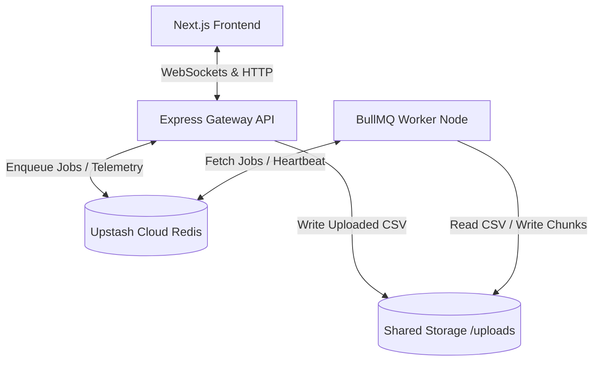

# Data Saab — High-Throughput CSV Validation Engine

Data Saab is an enterprise-grade, event-driven data engineering pipeline designed to ingest, validate, sanitize, and partition massive CSV datasets (up to 5GB) with a ultra-low memory footprint. It utilizes a decoupled Node.js and TypeScript monorepo backend powered by BullMQ, Redis, and Express, alongside a modern Next.js frontend with live telemetry.

---

## 🏗️ Architecture Overview

The system consists of three decoupled components communicating through a high-performance Redis message broker:



### 1. Frontend: Next.js Telemetry Dashboard (`/frontend`)
*   **Real-time Analytics**: Displays live metrics (total processed rows, valid rows written, anomalies dropped) using WebSocket event piping.
*   **Worker Node Live Status**: Features a dynamic, emerald-green / rose-red active indicator badge that polls the gateway `/status` endpoint to track the presence of worker processes in real time (using a 5-second Redis ping expiration).
*   **Interactive Terminal Console**: An expandable worker console displaying live processing logs, validation alerts, and stream statistics using Framer Motion animations.

### 2. Backend Gateway API (`/backend`)
*   **Streaming File Upload**: Uses `multer` to stream uploaded CSV files directly to the shared `/uploads` volume on disk without buffering them into memory.
*   **Job Brokerage**: Enqueues CSV processing jobs into a BullMQ queue (`csv_processing_jobs`) and returns `202 Accepted` with a `jobId`.
*   **WebSocket Event Broker**: Subscribes to BullMQ `QueueEvents` (`progress`, `completed`, `failed`) and broadcasts them to active WebSocket clients.

### 3. Backend Processing Worker (`/backend`)
*   **Low Memory Footprint**: Leverages native Node.js streams and `fast-csv` to process millions of rows with minimal memory usage.
*   **Validation Engine**:
    *   **Phone Standardization**: Parses and validates phone numbers using `libphonenumber-js` (defaulting country code to `IN` if missing, supporting country-specific formats).
    *   **Date Standardization**: Parses common date formats using `date-fns` and outputs unified, ISO-compliant timestamps (`yyyy-MM-DD HH:mm:ss`).
    *   **Dynamic Column Passthrough**: Keeps any unrecognized custom headers in the output intact.
*   **Roll-over Partitioning**: Valid rows are partitioned and written to `chunk_X.csv` files, rolling over every 50,000 valid rows.
*   **Graceful Shutdown & Heartbeat**: Pings an active timestamp to a Redis sorted set (`worker:active_pings`) every 2 seconds. Automatically handles termination signals (`SIGINT`/`SIGTERM`) to clean up heartbeats immediately.

---

## 🛠️ Tech Stack

*   **Frontend**: Next.js (App Router, TypeScript, TailwindCSS, Framer Motion, Lucide Icons).
*   **Backend**: Node.js, TypeScript, Express, BullMQ, Redis (`ioredis`), `fast-csv`, `libphonenumber-js`, `date-fns`, `archiver`.
*   **Infrastructure**: Upstash Cloud Redis, Shared Disk Storage.

---

## 🚀 Getting Started

### 1. Prerequisites
*   Node.js (v18+)
*   An active Redis instance (e.g., Upstash Redis)

### 2. Environment Setup
Create a `.env` file in `/backend/.env`:
```env
REDIS_URL=rediss://default:<your-password>@<your-redis-host>:6379
PORT=8000
```

### 3. Installation
Install dependencies in both directories:
```bash
# Install backend dependencies
cd backend
npm install

# Install frontend dependencies
cd ../frontend
npm install
```

### 4. Running the Project

Open three terminal windows/tabs:

*   **Terminal 1 (Backend Gateway)**:
    ```bash
    cd backend
    npm run start:gateway
    ```
*   **Terminal 2 (Backend Worker)**:
    ```bash
    cd backend
    npm run start:worker
    ```
*   **Terminal 3 (Frontend Dashboard)**:
    ```bash
    cd frontend
    npm run dev
    ```

Navigate to `http://localhost:3000` to access the Data Saab Dashboard.

---

## 📁 Project Structure

```
transactval/
├── backend/
│   ├── src/
│   │   ├── gateway.ts          # Express API & WebSocket broker
│   │   └── worker.ts           # BullMQ Worker Node & Heartbeat ping
│   ├── package.json
│   └── tsconfig.json
├── frontend/
│   ├── src/app/
│   │   ├── layout.tsx          # App base layout & metadata
│   │   ├── page.tsx            # Next.js interactive dashboard UI
│   │   └── icon.png            # App favicon icon
│   └── package.json
├── shared_volume/
│   ├── uploads/                # Temporary directory for uploaded CSVs
│   └── outputs/                # Final chunk directories and compiled .zip files
└── README.md                   # Project documentation
```

---

## 🛡️ Validation & Partitioning Rules

1.  **Row Dropping Criteria**:
    *   Missing `Order ID`
    *   Missing `Product Name`
    *   Missing `Payment Method`
    *   Invalid or negative `Amount`
    *   Missing or invalid `Phone Number` (validated using country code context)
    *   Unparseable or invalid `Date`
2.  **Date formatting**: Formatted to `"yyyy-MM-dd HH:mm:ss"`.
3.  **Partitioning**: Automatically splits data into zipped files containing a maximum of 50,000 valid records per CSV chunk.
